# Bridge

### Good food should be within reach.

Bridge helps people plan a week of meals around their budget, food preferences,
nutrition goals, and location—and discover food resources in their community.
Built for HackGT 13 (2026), it combines a curated recipe catalog, nutrition-based
ranking, store-aware price estimates, and generative AI with deterministic
validation and cost calculations.

**[Try the live app](https://bridge-hackgt.vercel.app)** ·
**[Our mission](https://bridge-hackgt.vercel.app/mission)** ·
**[Source code](https://github.com/shivenmehta/hackgt-26)**

## Contents

- [Inspiration and hackathon submission](#inspiration-and-hackathon-submission)
- [What you can do](#what-you-can-do)
- [Weekly planning flowchart](#weekly-planning-flowchart)
- [How the algorithm works](#how-the-algorithm-works)
- [Architecture and technology](#architecture-and-technology)
- [Run locally](#run-locally)
- [Configuration](#configuration)
- [Database and data setup](#database-and-data-setup)
- [Deployment](#deployment)
- [Testing and useful commands](#testing-and-useful-commands)
- [API overview](#api-overview)
- [Repository guide](#repository-guide)
- [Limitations and next steps](#limitations-and-next-steps)
- [Troubleshooting](#troubleshooting)
- [Sources and acknowledgments](#sources-and-acknowledgments)

## Inspiration and hackathon submission

When everyday expenses stretch a household's budget, nutritious meals can become
harder to plan and afford. Income is only part of the problem: geography also
shapes which foods are accessible. Food deserts have limited access to affordable,
nutritious food; food swamps offer plentiful options that may not support a
balanced diet.

We built Bridge to help with both barriers. The weekly planner helps users make
food decisions around their circumstances, while Community connects them with
nearby retailers, assistance resources, and food-sharing posts. Our aim is to
reduce the effort of figuring out what to eat and where to find it. We have not
yet measured financial savings, health outcomes, or reductions in food waste.

### Submission overview

| Item                         | Details                                                                                      |
| ---------------------------- | -------------------------------------------------------------------------------------------- |
| Project                      | Bridge                                                                                       |
| Event                        | HackGT 13, 2026                                                                              |
| Intended audience            | People managing constrained or moderate food budgets                                         |
| Chosen track                 | A Marina's Mission, presented by Aramco Americas                                             |
| Additional sponsor challenge | Visa — Reimagine Shopping with Generative AI                                                 |
| Live demonstration           | https://bridge-hackgt.vercel.app                                                             |
| Generative AI                | Grok interprets notes, assists pricing, assembles meal selections, and generates food images |
| Algorithmic component        | Python nearest-neighbor nutrition ranking plus deterministic validation and budget repair    |

The Visa connection is food discovery, personalization, and shopping decisions.
**The MVP does not implement Visa payments, checkout, or a Visa API integration.**
Confirm sponsor eligibility and current deliverables before submitting. The
repository's [event packet](EVENT_PACKET.md) is a dated reference with documented
coverage gaps, not a replacement for current organizer guidance.

### Suggested demo walkthrough

1. Open the planner and use **Use example preferences** to populate the form.
2. Choose a cuisine, budget, household size, and nutrition preferences. Explain
   that a single-person household can edit its daily calorie target.
3. Select **Build my week**. Show the filtering, ranking, and pricing progress.
   A small cuisine selection is useful for a first live demonstration; uncached
   ingredient searches can take several minutes.
4. Open a completed meal to show its recipe, scaled quantities, cost, and nutrition.
5. Try a replacement and open **Grocery list** to show combined essentials,
   pantry checkboxes, the full-list toggle, and export options.
6. Open **Community**, search a location, and inspect source-labeled resources.
7. Explain the giveaway-hosting flow and private cancellation link. Avoid
   publishing fictitious food availability to the live app during a demo.
8. Close with **Our mission** and the next step: ingredient-overlap-aware planning.

Before submission, add the team members and roles, the final demo-video URL, and
any required Devpost fields. Be explicit about source datasets, AI estimates,
and advance preparation. Shared foundation materials were imported from an
earlier repository; original documentation is retained in
[docs/source-project](docs/source-project). Do not describe all preparatory work
as having been created during the hacking window.

## What you can do

### Weekly planner

- Enter a weekly USD budget, five-digit US ZIP, household size, age, BMI, dietary
  patterns, allergen exclusions, cuisines, and additional notes.
- Search all 21 catalog cuisines in a multi-select dropdown.
- Set Low/Medium/High preferences for calories, protein, fat, fiber, and carbs.
- Generate breakfast, lunch, and dinner for seven dated days beginning Monday
  of the current local week.
- View recipes, estimated ingredient-use costs, nutrition, preparation time, and
  household-scaled quantities.
- Resume a job after reloading in the same browser, cancel it, edit preferences,
  or choose a replacement from saved priced rankings.
- See MealDB images immediately; generated food images can arrive afterward.

### Grocery essentials

The grocery panel sums ingredients across every selected meal and scales them
for the household. It normalizes common name variants, groups items by shopping
section, and retains materially different preparation states separately.

The default view hides pantry basics, sauces, seasonings, and other extras.
**Show full ingredient list** restores them; omitted items may still be needed
to follow a recipe exactly. Check **Already have this** to remove an item from
the panel's unchecked-item subtotal. Copy or download the visible list.

The list updates after meal replacements. Checkmarks live in browser memory and
reset on refresh. Hiding ingredients does not change recipe nutrition or the
meal plan's cost. Quantities describe food used, not whole packages to purchase.

### Community and mission

- Map and list views of nearby food resources, with source and availability details.
- OpenStreetMap food retailers and potential assistance contacts.
- USDA SNAP retailer snapshot searches.
- Feedam / Feed America resource and urgent-listing searches.
- Community giveaways with public sharing and private cancellation links.
- Address/place autocomplete and explicit host location confirmation.
- An Our mission page explaining the inspiration and user experience.

Provider schedules, eligibility, hosts, and food inventory are not independently
verified. Missing or failed sources are shown as partial results.

## Weekly planning flowchart

GitHub renders the Mermaid diagram below. It describes the implemented pipeline;
pricing occurs **after** nutrition ranking and only covers the shortlist.

```mermaid
flowchart TD
    A(["Build my week"]) --> B["Validate preferences and compute targets"]
    B --> C["Create private Supabase job<br/>Idempotency and one-active-plan protection"]

    subgraph FILTER["1 · Prepare and filter"]
      C --> D["Load prepared catalog<br/>MealDB recipes + Grok nutrition, yields, and metadata"]
      D --> E["Grok interprets additional notes<br/>Extract supported restrictions and exclusions"]
      E --> F["Deterministic filtering<br/>Cuisine, diet, allergens, excluded ingredients"]
      F --> G{"Eligible meals for each category?"}
      G -->|Yes| I["Set per-person daily nutrition targets"]
      G -->|Breakfast missing| H["Use eligible main dishes as<br/>labeled breakfast alternatives"]
      H --> I
      G -->|No meals or missing lunch/dinner| ERR["Actionable error<br/>Edit preferences or retry"]
    end

    subgraph RANK["2 · Python KNN ranking"]
      I --> J["Divide daily targets across three meals<br/>Divide recipe nutrition by estimated yield"]
      J --> K["Try 0.5–2 servings per person<br/>in 0.25-serving increments"]
      K --> L["Standardized Euclidean distance<br/>Calories, protein, fat, fiber, carbs<br/>Full-catalog normalization"]
      L --> M["Rank each meal category<br/>Retain scores and all portion alternatives"]
      M --> N["Top 20 recipes per category<br/>Deduplicate shared recipes"]
    end

    subgraph PRICE["3 · Price the shortlist"]
      N --> O["Search Kroger: 15, 30, then 50 miles"]
      O --> P{"Suitable nearby store?"}
      P -->|Yes| Q["Choose nearest returned store"]
      P -->|No| R["Use Atlanta reference store<br/>1715 Howell Mill Rd NW"]
      Q --> S["Deduplicate shortlist ingredients"]
      R --> S
      S --> T{"Unexpired ingredient-price cache?"}
      T -->|Yes| W["Calculate consumed-ingredient costs"]
      T -->|No| U["Search Kroger products<br/>Grok assists matching and package conversion"]
      U --> V["Use regular store price when matched<br/>Otherwise request Grok US-average estimate"]
      V --> W
      W --> X["Exclude unpriceable recipes<br/>Keep priced shortlist rankings"]
      X --> Y{"Priced choices for every category?"}
      Y -->|No| ERR
    end

    subgraph ASSEMBLE["4 · Build and validate the week"]
      Y -->|Yes| Z["Grok selects 21 meal slots<br/>Rankings, prices, budget, household, notes, variety"]
      Z --> AA{"Valid IDs, portions, and slots?"}
      AA -->|Yes| AD["Calculate household totals"]
      AA -->|No| AB["One corrective Grok retry"]
      AB --> AC{"Valid retry?"}
      AC -->|Yes| AD
      AC -->|No| FALL["Deterministic ranked selection"]
      FALL --> AD
      AD --> AE{"Over budget?"}
      AE -->|Yes| AF["Cheaper meal or portion substitutions<br/>Minimize ranking penalty per saving"]
      AF --> AG["Affordable result or cheapest shortlisted<br/>combination with explicit overage"]
      AE -->|No| SAVE
      AG --> SAVE["Save plan, prices, selections,<br/>full rankings, and priced rankings"]
    end

    subgraph DISPLAY["5 · Display and use"]
      SAVE --> CAL["Seven-day calendar<br/>Recipes, ingredients, costs, nutrition"]
      SAVE --> IMG["Generate and cache Grok images<br/>Image failure does not block the plan"]
      CAL --> GROC["Aggregate household grocery quantities"]
      GROC --> ESS["Essentials or full list<br/>Pantry checkboxes and exports"]
      CAL --> SWAP["Replacement options from saved priced rankings"]
      SWAP --> UPDATE["Validate replacement<br/>Recalculate plan and grocery list"]
      UPDATE --> CAL
    end

    classDef primary fill:#173B67,color:#fff,stroke:#173B67;
    classDef compute fill:#EDF5EE,color:#25313B,stroke:#237547;
    classDef decision fill:#FFF4CC,color:#25313B,stroke:#C6A333;
    classDef failure fill:#FFF0ED,color:#713F35,stroke:#B76B5A;
    class A,SAVE,CAL primary;
    class D,E,F,I,J,K,L,M,N,W,Z,AD,GROC,ESS,SWAP,UPDATE compute;
    class G,P,T,Y,AA,AC,AE decision;
    class ERR failure;
```



## How the algorithm works

### Catalog preparation and filtering

The deployment ships 300 MealDB recipes across 21 cuisines, joined by MealDB ID
to the best-effort Grok nutrition catalog. Preparation adds estimated yields,
ingredient grams, diet/allergen classifications, meal categories, assumptions,
and source fingerprints. Original source catalogs are preserved.

Cuisine selection uses OR; selected diets and allergen exclusions apply together.
Unknown relevant compatibility excludes a recipe. Grok can extract additional
restrictions from notes, but code enforces eligibility. Ambiguous requests remain
warnings. Ingredient-screened metadata is not a certified allergy guarantee.

### Nutrition targets and nearest neighbors

| Per-person daily target |        Low |     Medium |       High |
| ----------------------- | ---------: | ---------: | ---------: |
| Calories                | 1,800 kcal | 2,000 kcal | 2,200 kcal |
| Protein                 |       75 g |      100 g |      125 g |
| Fat                     |       45 g |       65 g |       80 g |
| Fiber                   |       20 g |       28 g |       35 g |
| Carbohydrates           |      200 g |      250 g |      300 g |

For one person, the editable calorie target overrides the preset. For larger
households, that override is ignored. Other nutrient targets scale proportionally
to effective calories. Age and BMI are collected but do not calculate requirements.
These are configurable demo matching preferences, not medical recommendations.

For nutrient `j`, portion `p`, per-serving recipe nutrition `x`, daily target `t`,
and full-catalog standard deviation `s`, Python computes:

```text
distance = sqrt(sum over five nutrients of ((p × x[j] − t[j] / 3) / s[j])²)
```

Zero-variance scales become 1. Each recipe's best portion is selected from
0.5, 0.75, 1, 1.25, 1.5, 1.75, and 2 servings. Categories are ranked by distance,
with recipe-ID tie breaking. All portion alternatives are retained. This is
nearest-neighbor ranking, not a trained classifier or gradient-descent optimizer.

### Pricing, selection, and budget repair

Only the union of the top 20 recipes per category is priced—at most 60 unique
recipes. Ingredient searches are deduplicated and processed four at a time.
The store search uses the supplied ZIP; a failed nearby search uses Kroger
location `01100346` in Atlanta as an explicit reference.

Grok assists product matching and quantity interpretation. Code calculates cost
from regular package prices, package quantities, preparation factors, and recipe
gram amounts. Unmatched ingredients can use labeled Grok US-average estimates.
Missing estimates never become zero-cost ingredients. Kroger price records cache
for 24 hours and model fallback estimates for seven days.

Grok chooses the week from ranked and cheapest priced candidates. Backend code
validates exactly 21 unique day/category slots, allowed IDs, and supported portions.
One invalid-output retry is permitted before deterministic selection is used.
Budget repair substitutes cheaper meals or portions, prioritizing the smallest
nutrition-distance penalty per cent saved. If the allowed shortlist cannot fit
the budget, the plan reports an overage. It does not establish the cheapest plan
across the entire catalog.

```text
Household ingredient amount = original recipe amount × portion × people / yield
Household meal cost = estimated per-serving cost × portion × people
```

Nutrition displayed per person is kept distinct from household quantities.
Plans and rankings persist in Supabase; images are generated afterward and cached.
Cancelling prevents subsequent work from reviving the job, although an already
in-flight provider call can finish. There is no hourly planner admission cap;
one-active-plan and duplicate-submission checks remain.

## Architecture and technology

| Layer                 | Implementation                                                              |
| --------------------- | --------------------------------------------------------------------------- |
| Website               | Next.js 16 App Router, React 19, TypeScript                                 |
| Interface             | Chakra UI 3, custom CSS, Bricolage Grotesque and Source Sans 3              |
| Web backend           | Next.js Route Handlers, Zod validation                                      |
| Long-running planning | Vercel Workflow                                                             |
| Nutrition ranker      | Python, FastAPI, pure standard-library ranking module                       |
| Community             | Python providers and FastAPI hosted adapter; Leaflet map                    |
| Database              | Supabase Postgres; local SQLite for local Community posts                   |
| Images                | MealDB images and Grok-generated images in Supabase Storage                 |
| AI and pricing        | xAI Grok and Kroger OAuth2 APIs                                             |
| Verification          | Node test runner, Python unittest, Playwright, ESLint, TypeScript, Prettier |
| Hosting               | Three Vercel projects: web, ranker, Community API                           |

The browser calls the web app. The web server holds provider keys and calls the
private Python APIs over authenticated HTTPS. The ranker has no database, Grok,
or Kroger credentials. Direct server-side APIs are used; no MCP server is required
to run the application.

### Storage and privacy

| Data                                                         | Storage                                                      |
| ------------------------------------------------------------ | ------------------------------------------------------------ |
| Plans, preferences, job progress, recipe snapshots, rankings | Supabase `planner_jobs`                                      |
| Ingredient prices and reusable planner data                  | Supabase `planner_cache`                                     |
| Generated images                                             | Supabase Storage `planner-images` bucket                     |
| Hosted Community posts and hashed cancellation capabilities  | Supabase `bridge_community_events`                           |
| Local Community posts                                        | `.local/community-events.sqlite3`                            |
| Source recipes, nutrition, and prepared metadata             | Versioned JSON under `data/`                                 |
| SNAP retailers                                               | Public SQLite snapshot bundled into the Community deployment |
| Local/hosted OSM cache                                       | Local SQLite / disposable `/tmp` cache                       |
| Grocery checkmarks                                           | Browser memory only                                          |

The existing deployed app and configured local planner use the same Supabase
project. Plans are owned through signed HttpOnly browser-session cookies; they
are not a public feed and there is no account login. A localhost session does
not automatically carry over to the deployed domain. Private tables use RLS and
server-only access. Generated food images are public-readable. Giveaway addresses
are public only after explicit host confirmation. Keep private cancellation links
safe: there is no account-based recovery.

## Run locally

### Prerequisites

- Node.js **24** and npm **11**; `.nvmrc` and `package-lock.json` are included.
- Python **3.12** recommended for parity with the deployed services.
- Supabase, Kroger developer, and xAI credentials for live meal planning.
- Chrome for the default Playwright browser configuration.

### Install and start

```bash
git clone https://github.com/shivenmehta/hackgt-26.git
cd hackgt-26
nvm use                       # If using nvm; otherwise install Node 24
npm ci
python3 -m venv .venv
.venv/bin/python -m pip install -r services/recipe-ranker/requirements.txt
cp .env.example .env.local
```

Fill in `.env.local` as described below and initialize a new database if needed.
Then run:

```bash
npm run dev
```

Open **http://localhost:3000**. The launcher starts:

| Service                  | Default local address |
| ------------------------ | --------------------- |
| Next.js                  | http://localhost:3000 |
| Community Python service | http://127.0.0.1:8765 |
| Python nutrition ranker  | http://127.0.0.1:8767 |

The launcher prefers `.venv`, loads `.env.local`, and generates missing service
and session tokens for that run. Set a stable `PLANNER_SESSION_SECRET` to preserve
session access across restarts. **Ctrl+C** stops the launched processes.

On Windows, use `.venv\Scripts\python.exe` for the install command and copy the
environment template with `Copy-Item .env.example .env.local` in PowerShell.
Set `PYTHON_COMMAND` if the launcher needs an explicit interpreter path.

### Local production preview

```bash
npm run build
npm run start:local
```

`npm run dev:web` and `npm start` start only Next.js. They do not launch the Python
services. Use the combined launcher for a working local Community and planner.
The application uses Webpack for its current Chakra/Emotion setup.

## Configuration

Never commit `.env.local`, private API keys, Vercel credentials, or management
links. Use [`.env.example`](.env.example) as the template. Do not prefix private
keys with `NEXT_PUBLIC_`.

| Variable                                   | Purpose                                                                                                         |
| ------------------------------------------ | --------------------------------------------------------------------------------------------------------------- |
| `NEXT_PUBLIC_SUPABASE_URL`                 | Supabase project URL                                                                                            |
| `NEXT_PUBLIC_SUPABASE_PUBLISHABLE_KEY`     | Public Supabase client configuration; not a replacement for a server key                                        |
| `SUPABASE_SECRET_KEY`                      | Server access to private planner and hosted Community tables; legacy `SUPABASE_SERVICE_ROLE_KEY` also supported |
| `GROK_API_KEY` or `XAI_API_KEY`            | xAI key for live planning, price assistance, and generated images                                               |
| `KROGER_CLIENT_ID`, `KROGER_CLIENT_SECRET` | Server-side OAuth2 client credentials for store/product lookup                                                  |
| `PLANNER_SESSION_SECRET`                   | Stable private random secret for browser-session ownership                                                      |
| `RANKER_SERVICE_TOKEN`                     | Shared private token between web and ranker                                                                     |
| `RANKER_SERVICE_URL`                       | Local ranker URL or deployed HTTPS origin                                                                       |
| `LOCATION_SERVICE_TOKEN`                   | Shared private token between web and Community service                                                          |
| `LOCATION_SERVICE_URL`                     | Community API origin; set by the local launcher                                                                 |
| `GROK_PLANNER_MODEL`, `GROK_IMAGE_MODEL`   | Optional model overrides; defaults are in the template                                                          |
| `RANKER_VERCEL_BYPASS_SECRET`              | Optional bypass for a protected ranker preview                                                                  |
| `USDA_API_KEY`                             | Manual USDA import/experiment scripts; not required for each live plan                                          |

Generate **independent** secrets for the session, ranker, and Community service:

```bash
openssl rand -hex 32
```

Additional Community options:

| Variable                                       | Purpose                                                   |
| ---------------------------------------------- | --------------------------------------------------------- |
| `LOCATION_EVENTS_BACKEND=supabase`             | Enable hosted event persistence; omit for local SQLite    |
| `LOCATION_EVENTS_DB`                           | Override local Community SQLite path                      |
| `LOCATION_CACHE_PATH`                          | Hosted OSM cache path, normally `/tmp/bridge-osm.sqlite3` |
| `LOCATION_SNAP_DB`                             | SNAP snapshot path; hosted value `snap-retailers.sqlite3` |
| `LOCATION_AUTOCOMPLETE_URL`                    | Optional private Photon-compatible endpoint               |
| `LOCATION_SERVICE_PORT`, `RANKER_SERVICE_PORT` | Override local service ports                              |

## Database and data setup

### New Supabase project

Apply the SQL files in `supabase/migrations/` **in timestamp order**, once each:

1. `202609260001_create_foods.sql` — USDA foods schema.
2. `20260926232739_bridge_planner.sql` — private jobs, cache, admission function, image bucket.
3. `20260927005149_planner_cancellation.sql` — cancelled job status.
4. `20260927013802_remove_planner_hourly_limits.sql` — remove hourly admission caps.
5. `20260927030707_community_hosted_storage.sql` — hosted Community persistence.

Use the SQL editor for these migration files or your configured Supabase migration
workflow. Do not rerun initial table-creation SQL on the already-configured shared
project. See [planner documentation](docs/MEAL_PLANNER.md) for access boundaries.
The curated USDA foods table is separate from the planner's runtime recipe catalog;
loading its seed is not required to run the prepared weekly planner.

### Catalogs and regeneration

| Catalog                      | Role                                                                           |
| ---------------------------- | ------------------------------------------------------------------------------ |
| `data/usda/`                 | 300 curated USDA ingredient records, manifests, and provenance                 |
| `data/mealdb/`               | 300 original recipes, instructions, ingredients, and cuisine metadata          |
| `data/combined/`             | Earlier USDA-based recipe nutrition experiments, including incomplete matches  |
| `data/grok-best-effort/`     | Best-effort whole-recipe nutrition estimates used by the current planner       |
| `data/planner/prepared.json` | Runtime recipe data with yields, classifications, quantities, and fingerprints |

The current planner uses prepared Grok nutrition estimates; it does not calculate
every recipe from USDA at request time. Earlier 100 g placeholders and partial
USDA totals are not evidence of exact recipe nutrition. Preserve source provenance
and read the individual catalog documentation before regenerating data.

```bash
npm run meals:query                  # Inspect the local MealDB catalog
npm run planner:prepare -- --offline # Rebuild using available preparation caches
npm run test:meals
npm run test:grok:best-effort
```

Live `planner:prepare` and Grok enrichment scripts can make paid calls. The
checked-in prepared catalog is sufficient for normal startup; regeneration is
not part of `npm run dev`.

### SNAP retailer snapshot

A new clone does not contain the large, gitignored public SQLite snapshot.
Download the CURRENT export from the [USDA retailer locator](https://www.fns.usda.gov/snap/retailer-locator),
save it as `test-results/snap-retailers.csv`, then import:

```bash
python3 -m src.lib.location.snap --csv test-results/snap-retailers.csv
```

The deployed Community service includes the public snapshot imported September
26, 2026, containing 251,574 retailers. This is a dated snapshot, not live inventory
or independent verification of current store participation. Local Community
posts are not automatically copied into the hosted database.

## Deployment

| Project       | Production URL                            | Source directory         |
| ------------- | ----------------------------------------- | ------------------------ |
| Bridge web    | https://bridge-hackgt.vercel.app          | Repository root          |
| Recipe ranker | https://bridge-recipe-ranker.vercel.app   | `services/recipe-ranker` |
| Community API | https://bridge-community-kappa.vercel.app | `services/community`     |

Python endpoints require shared tokens; they are called by the website rather
than directly by the browser. Configure production and preview variables in the
appropriate Vercel project:

- **Web:** Supabase, Kroger, Grok, session secret, both service tokens, and both
  deployed service URLs. Do not use localhost URLs in production.
- **Ranker:** only `RANKER_SERVICE_TOKEN`.
- **Community:** Supabase URL/server key, `LOCATION_SERVICE_TOKEN`,
  `LOCATION_EVENTS_BACKEND=supabase`, and cache/SNAP paths.

Deploy from an authenticated Vercel CLI after checking `.vercel` links belong to
your account and intended projects:

```bash
python3 scripts/prepare-community-deploy.py
npx vercel deploy --prod --cwd services/community
npx vercel deploy --prod --cwd services/recipe-ranker
npx vercel deploy --prod
```

For a fresh checkout, link/create each project first with `npx vercel link` in its
source directory. The Community preparation script copies Python source and an
optional public SNAP snapshot into its deployment directory. It does not copy
private SQLite events or credentials. Run it again after changing Community code.

Check the aliases returned by Vercel and update the web service URLs if they differ.
Do not protect the Workflow callback routes with application login middleware.
Production is currently **CLI-managed**: pushing to GitHub does not automatically
redeploy. Automatic Git links were disabled during the multi-service setup; a
future CI pipeline must stage Community source and deploy all relevant projects.

A successful build alone is insufficient verification. Test autocomplete, nearby
sources, a complete plan, reload/resumption, meal details, and the grocery list.

## Testing and useful commands

### Core verification

```bash
npm run lint
npm run typecheck
npm run format:check
npm run test:meal-planning
npm run test:planner
npm run test:ranker
python3 -B -m unittest discover -s tests -p 'test_*.py' -q
npm run build
npm run test:bridge
npm run test:location-ui
```

Browser suites launch separate local production servers after a build. Chrome is
the default; `PLAYWRIGHT_CHANNEL=msedge` selects installed Edge. Keep test output
under its dedicated directories; other `test-results` files may contain public
snapshots or caches needed by development.

Tests cover nutrient targets, filtering, ranking/portion contracts, budget repair,
scaling, invalid AI output, pricing provenance, cancellation ownership, grocery
aggregation, provider parsing, event validation, hosted storage, and browser flows.
The hosted rollout also verified a real completed plan and all four Community
sources. Test coverage is not a claim that every provider is always available.

### Data tools and manual experiments

| Command                              | Purpose                                                 |
| ------------------------------------ | ------------------------------------------------------- |
| `npm run meals:query`                | Query the local recipe catalog                          |
| `npm run meals:build`                | Rebuild the MealDB catalog                              |
| `npm run meals:nutrition`            | Rebuild the earlier USDA recipe-nutrition comparison    |
| `npm run meals:grok:best-effort`     | Estimate recipe nutrients with Grok; paid network calls |
| `npm run planner:prepare`            | Prepare runtime metadata; may make paid Grok calls      |
| `npm run export:foods`               | Export the USDA foods dataset                           |
| `npm run test:foods`                 | Verify foods import/export behavior                     |
| `npm run test:usda:get-foods-search` | Manual live USDA search experiment                      |
| `npm run test:usda:get-food`         | Manual live USDA food-detail request                    |
| `npm run format`                     | Format files with Prettier                              |

See `package.json` for the complete script list and read a script's usage before
running an importer. Names beginning `test:usda` are manual API experiments, not
offline automated tests. Do not run paid catalog enrichment just to start the app.

## API overview

| Endpoint                                     | Purpose                                                    |
| -------------------------------------------- | ---------------------------------------------------------- |
| `GET /api/health`                            | Web health check                                           |
| `POST /api/plans`                            | Validate input and start/resume an idempotent planning job |
| `GET /api/plans/:id`                         | Owner-scoped progress, completed plan, and image updates   |
| `POST /api/plans/:id/cancel`                 | Cancel an owned in-progress plan                           |
| `GET /api/plans/:id/replacements?slotId=...` | Saved-ranking replacement options and deltas               |
| `POST /api/plans/:id/replacements`           | Validate and apply a replacement with version checking     |
| `GET /api/location/nearby`                   | Aggregate nearby food resources                            |
| `POST /api/location/suggest`                 | Address/place autocomplete                                 |
| `POST /api/location/geocode`                 | Host address confirmation lookup                           |
| `POST /api/location/events`                  | Create a community giveaway                                |
| `GET /api/location/events/:id`               | Read public event details                                  |
| `POST /api/location/events/:id/cancel`       | Cancel using a private capability                          |
| `POST /rank` on the ranker service           | Authenticated recipe nutrition ranking                     |

Planning submissions include preferences, a local date, and an idempotency UUID.
Browser mutations must originate from the same site. Ranker input includes schema
version, full-catalog per-serving nutrition, eligible IDs/categories, and daily
targets; output includes rankings, suggested portions, distances, deviations, and
normalization scales. See [ranker documentation](services/recipe-ranker/README.md)
and [Community API documentation](src/lib/location/README.md) for details.

## Repository guide

```text
src/app/                       Next.js pages, API routes, styles, local fonts
src/components/bridge/         Planner, meal details, controls, grocery panel
src/components/location/       Community map, search, and event interfaces
src/lib/meal-planning/         Workflow, filtering, pricing, assembly, persistence
src/lib/groceries.ts            Grocery aggregation and essentials classification
src/lib/location/             Python providers, local service, hosted event storage
services/recipe-ranker/        Stateless FastAPI nutrition ranker
services/community/           Hosted FastAPI Community adapter and staging output
scripts/                      Imports, experiments, catalog preparation, deploy staging
data/                         Source catalogs and prepared recipe data
supabase/migrations/          Foods, planner, and Community database definitions
tests/                        TypeScript, Python, and browser checks
docs/MEAL_PLANNER.md           Detailed planner and deployment notes
AGENTS.md                     Repository conventions and implementation context
EVENT_PACKET.md               Dated hackathon requirements/reference
PROJECT_CONTEXT.md            Original direction and track rationale
```

## Limitations and next steps

- Nutrition, recipe yields, quantity conversions, and some prices are AI estimates.
  Ingredient screening cannot guarantee allergen safety or account for cross-contact.
- Costs cover consumed ingredients, not package rounding, taxes, delivery, or an
  actual checkout. Atlanta reference prices may differ from local prices.
- Budget coverage is limited to the priced shortlist. Unpriced candidates are not
  automatically explored for budget repair or replacements.
- Ingredient overlap does not yet influence weekly selection. A shorter essentials
  list does not mean the algorithm minimized the number of ingredients needed.
- Grocery categorization is heuristic; preparation assumptions may produce separate
  entries for ingredients that look similar.
- No user accounts, cross-device saved-plan library, live restaurant ordering,
  payment integration, or measured impact claims are included.
- External providers can be slow, incomplete, or unavailable. Source warnings and
  reference/fallback labels are part of the experience.
- Community's existing request throttles are per process, not a distributed
  production abuse-prevention system. Moderation and broader access controls remain
  future work for a larger public rollout.

Next priorities: ingredient reuse during selection, package-aware checkout
estimates, leftover-aware schedules, pantry-aware planning, persistent personal
preferences, and a sponsor-supported shopping/payment flow.

## Troubleshooting

| Symptom                                                     | What to check                                                                                                |
| ----------------------------------------------------------- | ------------------------------------------------------------------------------------------------------------ |
| Community autocomplete says not found after pulling changes | Restart the full `npm run dev` launcher; the running Python process does not automatically reload new routes |
| Location service is unavailable                             | Use `npm run dev`, not only `dev:web`; check matching tokens and service URL                                 |
| Python ranker unavailable                                   | Install `.venv` requirements; verify URL/token and any preview deployment protection                         |
| Planner storage is not configured                           | Add the server Supabase key and apply migrations; a publishable key cannot access private jobs               |
| A plan is already running                                   | Resume or cancel the existing job; closing the tab or stopping a process does not cancel its database record |
| Pricing takes a long time                                   | First-time searches and model conversions are slower; subsequent valid cache hits help                       |
| No matching or fully priced recipes                         | Broaden cuisines or retry unavailable providers; restrictions are not silently relaxed                       |
| Nearby results are partial                                  | Inspect source warnings; import the SNAP snapshot locally and retry temporarily unavailable providers later  |
| Generated images are missing                                | The plan remains usable with MealDB images; image generation is nonblocking                                  |
| Local plans do not appear on production                     | Session cookies belong to their browser/domain; shared Supabase does not imply shared sessions               |
| Changes pushed to GitHub are not live                       | Vercel is currently CLI-managed; run the documented deployment steps                                         |

## Sources and acknowledgments

- **TheMealDB:** original recipe catalog, instructions, ingredients, and recipe images.
- **USDA FoodData Central:** curated ingredient nutrition and earlier matching experiments.
- **USDA SNAP retailer data:** dated retailer-locator snapshot.
- **Kroger:** store/product lookup and regular-price data when available.
- **xAI Grok:** estimated nutrients/metadata, note interpretation, pricing assistance,
  weekly selections, and generated food imagery.
- **OpenStreetMap contributors / Overpass:** mapped retailers and potential resources.
- **Photon:** address/place autocomplete from OSM data.
- **US Census geocoder:** host address lookup and location support.
- **Feedam / Feed America:** resource listings; this is not Feeding America.
- **Supabase and Vercel:** persistence, storage, hosting, and workflow infrastructure.

Source content retains its providers' terms and attribution obligations. Inclusion
in this repository does not grant ownership of third-party recipes, images, or
datasets. Preserve provenance and source labels when presenting or extending Bridge.
