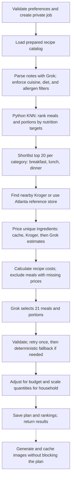

# Meal-planning backend

Each request runs through Next.js and Vercel Workflow using prepared MealDB
recipes, Grok nutrition estimates, serving yields, and dietary metadata.

- KNN compares calories, protein, fat, fiber, and carbohydrates using standardized
  Euclidean distance, testing portions from 0.5 to 2 servings per person.
- Budget adjustments and replacements use priced shortlisted meals. Costs reflect
  ingredients consumed, not grocery checkout totals. Unavoidable overages are shown.
- No suitable or fully priced options produces an actionable error. Dietary
  restrictions are never relaxed; missing breakfasts may use labeled main meals.
- Saved rankings support replacements. MealDB images remain available while
  optional generated images are pending.

Source: [workflow](../src/lib/meal-planning/workflow.ts) and
[pipeline steps](../src/lib/meal-planning/pipeline.ts).
